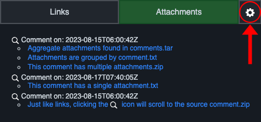
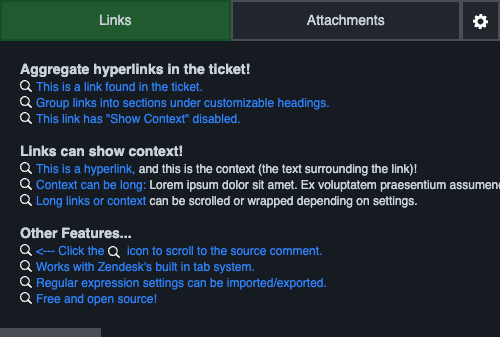
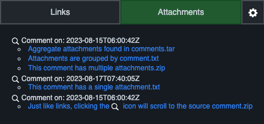
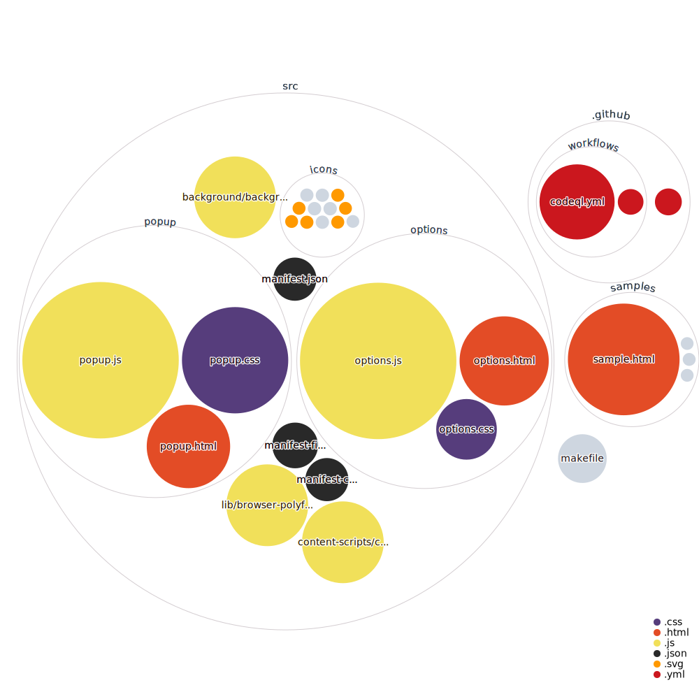

# Zendesk Link Collector 

This is a browser extension that collects links from a Zendesk ticket according to custom Regular Expression (regex) values. This tool's purpose is to help Zendesk users more easily handle _long_ tickets where links and/or attachments are key information.

## Installation
This extension can be installed from the [Firefox addons store](https://addons.mozilla.org/en-CA/firefox/addon/zendesk-link-collector/) or the [Chrome web store](https://chrome.google.com/webstore/detail/zendesk-link-collector/nckhapficnbbmcpapjnnegpagfcbjpja).

 

You can also manually [install it from the source code](#chrome-manual-installation).

## Configuration
Access the configuration page to set link regex patterns you would like to aggregate from tickets.

### Google Chrome and Firefox

Click the ⚙️ icon in the top-right corner of the extension popup to open the configuration page.

## Features

### Link Aggregation
- Links are aggregated according to custom regex patterns.
- No other chaos from the ticket is included in the link, only actual links are considered (`a` anchor elements).
    - Links can optionally display "context" when the "Show context?" checkbox option selected. This shows the surrounding text beside the link (the context is the parent HTML element of the `a` element).  
- Scroll to a link's source comment by clicking the spyglass icon (🔍) beside a link.

### Attachment Aggregation
- Attachments are aggregated.
- Scroll to an attachment's source comment by clicking the spyglass icon beside a link.

### Chrome Manual Installation
1.  Clone the repository or download and extract the ZIP file to your local machine.
2.  Open `chrome://extensions` in your Google Chrome browser.
3.  Turn on `Developer mode` by clicking the toggle in the top-right corner.
4.  Click on the `Load unpacked` button and select the `src` folder in the directory containing the extracted ZIP file.

## Project Strucutre

The project is structured like a typical manifest v3 browser extension, with some slight differences. For example, we have separate browser-specific manifest files and a `makefile` to build for each target browser.

Below is a diagram of the project using [`githubocto/repo-visualizer`](https://github.com/githubocto/repo-visualizer/).

